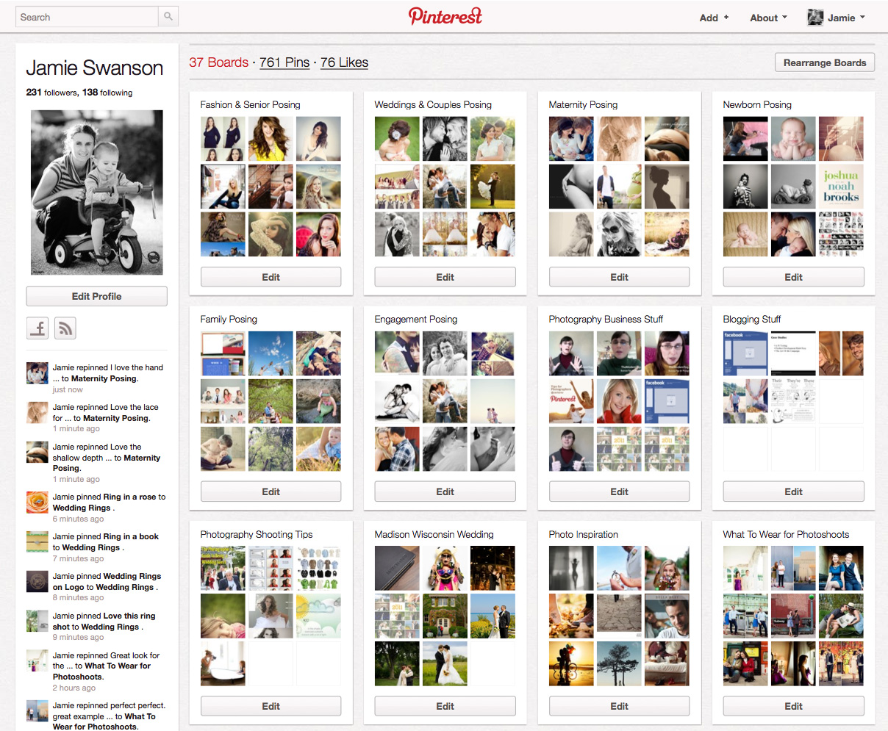

# Pinteresting - Pinterest Clone

For this project, we're going to explore Ruby on Rails by creating a clone of the popular website [Pinterest.com](http://pinterest.com). I encourage you to create an account and try it out.

### Phase 1: Design Phase
It is useful to sit down and write out what you think you will need to build for our application. Our videos will cover a very specific features like user login/signup, file upload, etc. but what else do you want to allow your users to do?

At its core, Pinterest allows users to have a profile and share "pins" to their profile. It also allows them to be organized into "boards". What other features do you think would be useful for this app?

I would recommend starting with the core feature set before adding features like following other users or tagging pins.

### Phase 2: Creating our Rails App

Go ahead and create a new Rails app and a Github repository. Add git tracking to your Rails project and make sure you can push your code up to your Github repository.

### Phase 3: Add Bootstrap to our Project
* [Use Bower to Install Bootstrap](./bootstrap.md)

### Phase 4: Add our user registration system

We will be using the [Devise gem](https://github.com/plataformatec/devise) for our user registration.

We need to use Devise to let our users create an account (sign up) and/or login to our application.

Once we have our user accounts, we can start to enforce certain behaviors such as not allowing someone to delete a pin that isn't theirs.

* [Use Devise to create a user registration system](./devise.md)

### Phase 5: Deploying to Heroku
[Heroku](http://heroku.com) is a service that will host our Pinteresting project and make it possible for other people to access our application.

This will be covered in class on 5/19.

[Using Rails 4 on Heroku](./heroku.md)

### Phase 6: Allow users to upload images for their pins
We will be using two tools for this, which will be covered in class during week 8.

[Using Paperclip for file uploads](./paperclip.md)

**More Resources**
  * [Paperclip Documentation](https://github.com/thoughtbot/paperclip)
  * [Image uploading with the Paperclip gem (video)](https://www.youtube.com/watch?v=Z5W-Y3aROVE)
  * [Amazon AWS](http://aws.amazon.com)

### Phase 7: Styling & Design

Use [Bootstrap](http://getbootstrap.com/)'s documentation to find CSS components that match what you are trying to build.

For our fluid and responsive Pinterest layout, we are going to use Masonry.js to render our pins on our index page.

[Learn more about using Masonry.js](https://github.com/rcacademy/pinteresting/blob/master/masonry.md)

## Features to consider

- [ ] Allow a user to comment on a pin
- [ ] Allow a user to organize pins into boards
- [ ] Allow a user to have a username and/or a profile
- [ ] Allow a user to have an avatar
- [ ] Allow a user to repin someone else's pin
- [ ] Allow a user to like/favorite/heart a pin
- [ ] Allow a user to search for pins
- [ ] Allow a user to organize pins by category
- [ ] Allow a user to follow another user's board or potentially all of their boards

## Videos on Youtube
1. [Using Devise](https://www.youtube.com/watch?v=qV9JFO7k-Dk)
2. [Adding Bootstrap](https://www.youtube.com/watch?v=K17A1ky8HeA)
3. [Creating our Pins](https://www.youtube.com/watch?v=TBhltBex2ts)
4. [Associating Users with Pins](https://www.youtube.com/watch?v=e5h2zEnX-tw)
5. [Adding File Uploads with Paperclip](https://www.youtube.com/watch?v=WQAR4bPeNCs)
6. [Adding Bootstrap Grid & Panels](https://www.youtube.com/watch?v=nFRHK1GW2c8)
7. [Adding Masonry to our Project](https://www.youtube.com/watch?v=UZsKyIhmOas)
8. [Adding support for usernames](https://www.youtube.com/watch?v=T-ms5zf6kg8)
9. [Adding support for user profile pages](https://www.youtube.com/watch?v=cMWIEU0ZkfU)
10. [Adding user bio and avatar](https://www.youtube.com/watch?v=1Xq0FjmP3sQ)
11. [Adding repinning](https://www.youtube.com/watch?v=OMeYP9LTGyM)
