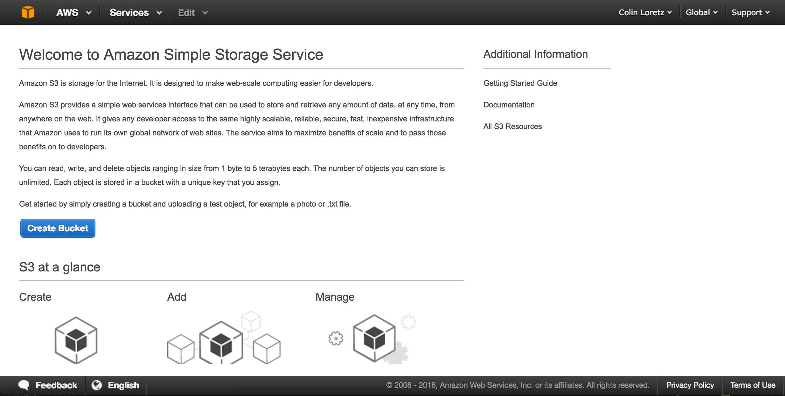
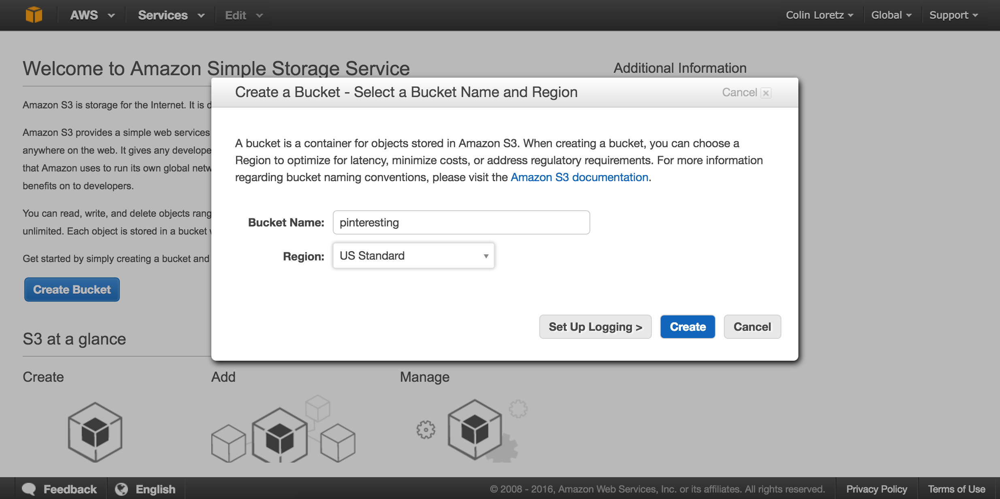
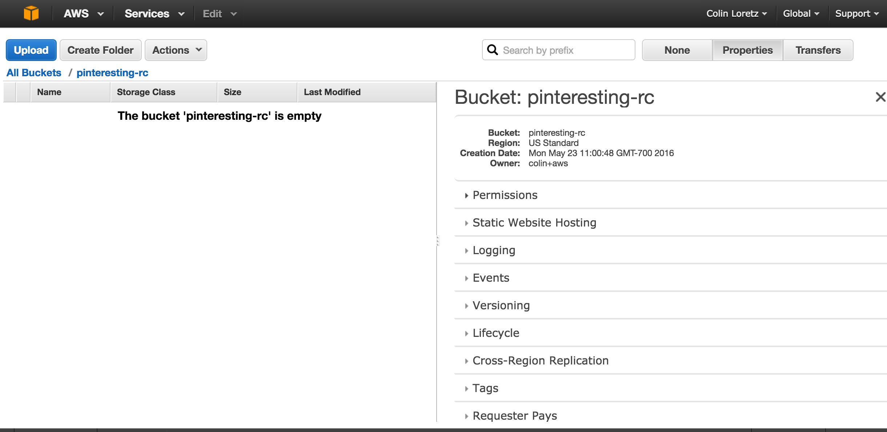
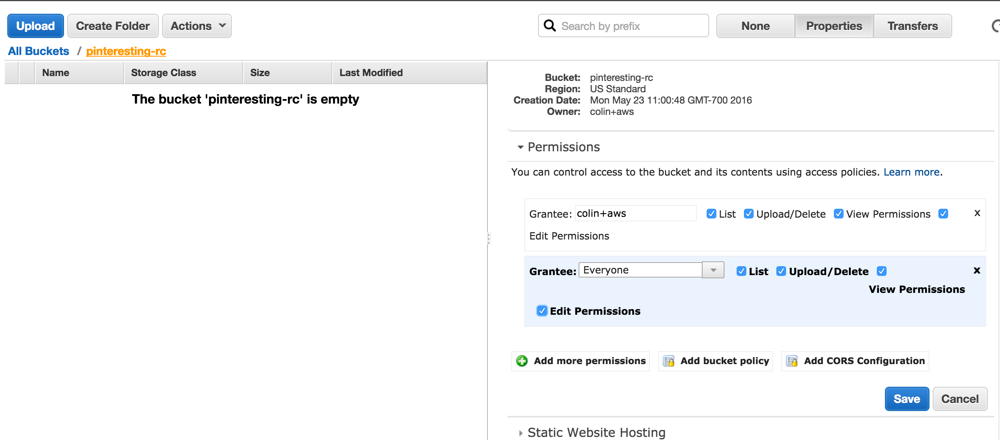
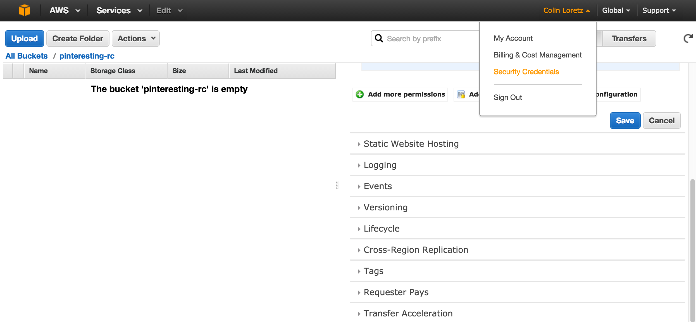
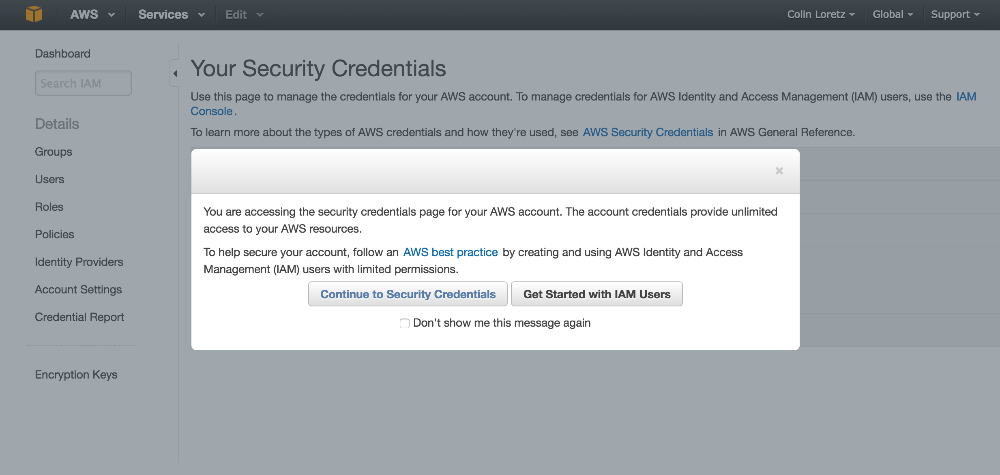
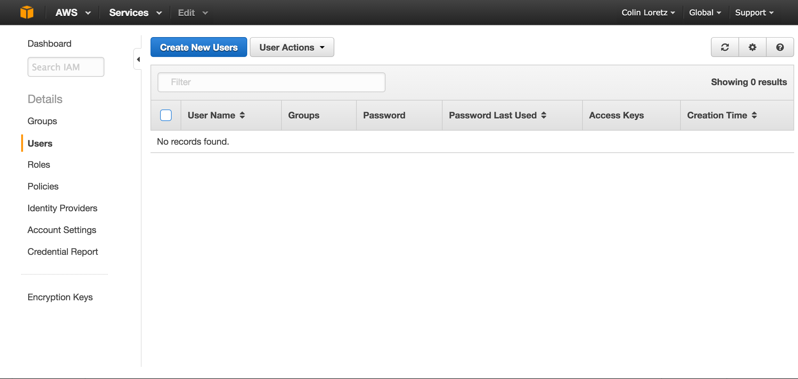
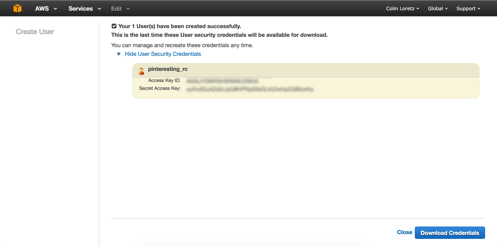

# Adding File Uploads

### Paperclip Gem
[Paperclip](https://github.com/thoughtbot/paperclip) is a gem that allows for easy file uploading in your Rails app.

The [documentation](https://github.com/thoughtbot/paperclip) for Paperclip can help you get started but the first step is to make sure we have ImageMagick installed. ImageMagick is a command line utility for working with and manipulating images.
##### PC

Install ImageMagick using the [Windows Binary here](http://www.imagemagick.org/script/binary-releases.php#windows).

You will also need a command line tool called "file" which is not available on Windows. You can install it by following the instructions here: [https://github.com/thoughtbot/paperclip#file](https://github.com/thoughtbot/paperclip#file).

##### Mac
Install [Homebrew](http://brew.sh/) if you don't already have it. You can check to see if you have it by entering `brew -v` in your terminal.

Once you have Homebrew, go ahead and install `imagemagick`.

`brew install imagemagick`

#### Test that ImageMagic is working
You can run `which convert` to see if ImageMagick has been installed properly.


### Using Paperclip

#### Install Paperclip

Add paperclip to your Gemfile and run `bundle install`.

```ruby
gem 'paperclip', '~> 4.3', '>= 4.3.6'
```

#### Adding an attachment to your model
For this project, let's assume I have a model called `Pin`. We're going to add an image attachment to our Pin model. You can name your field whatever you'd like, we're going to call ours `pin_image`.

```ruby
class Pin < ActiveRecord::Base
  has_attached_file :pin_image, styles: { medium: "300x300>", thumb: "100x100>" }
  validates_attachment_content_type :pin_image, content_type: /\Aimage\/.*\Z/
end
```

The styles we have defined for `pin_image` will allow us to access multiple sized versions of the image that is uploaded. Paperclip will use ImageMagick to automatically create those thumbnail sizes for us.

The 2nd line in our model helps us to verify that an image was uploaded. You can modify this to support other content types in the future. For example, you might want to support PDF uploads.

#### Generate a migration to add the attachment to your model

We can generate a paperclip specific migration by doing the following in our terminal.

`rails generate paperclip <model> <field_name>`

So for our example, I'll go ahead and run:

`rails generate paperclip pin pin_image`

Now perform `rake db:migrate` to run the migration and update our `Pin` model.

Now that we have added our field to the model and updated the database, we need to update our form for creating a pin.

#### Updating our view

Forms that upload files must have an attribute on them that indicates they support multipart form uploads. We can do this by adding `html: { multipart: true }` to our form_for element.

Next, we can add a `file_field` to our form and use the attribute we gave it.

```
<%= form_for @pin, url: pins_path, html: { multipart: true } do |form| %>
  <%= form.file_field :pin_image %>
<% end %>
```

If we try to create a new record with an image it will fail because we haven't added the `pin_image` attribute to our controller yet. Let's do that next.

#### Update our controller to permit the image attribute

In our app, we have defined `pin_params` to support a pin description but now we will add the `pin_image` attribute as well.

```ruby
def pin_params
  params.require(:pin).permit(:description, :pin_image)
end
```

We're almost there! If you go to your new_pin_path, you should be able to add a description and upload a file. Now we need to output the image to the screen.

#### Showing our images in our views

We can access the pin's pin_image after we've uploaded a file. Here are a few examples using the full image url, :medium and :thumb styled that we defined in our model.

The image_tag will render an `` tag for us.

```
<%= image_tag(@pin.pin_image.url) %>

<%= image_tag(@pin.pin_image.url(:medium)) %>

<%= image_tag(@pin.pin_image.url(:thumb)) %>

```

If we want to make an image a link, we can do that with a combination or `link_to` and `image_tag`.

In this case, `@pin` is an instance variable that contains our pin.
```
<%= link_to image_tag(@pin.image.url(:medium)), @pin %>
```

This can also be written with the path defined.

```
<%= link_to image_tag(pin.image.url(:medium)), pin_path(@pin) %>
```

### Uploading files to Amazon S3

Now that we have images working on our local computers, we need to think about how we might support this on our server.

We are using Heroku for this class which does not function the same as other servers. If we deploy our code to Heroku, it should work but you will find that any of your uploaded files will eventually be deleted as Heroku does not support storing files.

To fix this, we're going to store our image using another 3rd party service called Amazon Web Services (AWS). AWS has a product called `S3` which is for storing files and content.

Paperclip supports uploading to S3 but we need to set it up manually.

#### Sign up for an Amazon AWS Account

Create a few account at [http://aws.amazon.com](http://aws.amazon.com). It might ask for a credit card but all users get added to the free tier to start with.

#### Setup S3
Find the S3 service under the Services tab. There should be an option to create a **new bucket**. Buckets are containers that we will use to store our files. You can use buckets to organize your uploads for 1 or more applications that you build so you don't have to create a new AWS account for each project you work on.




Give your bucket a name and select **US Standard** for the region, click **Create**



Click on the bucket name and then the **Properties** tab in the top right corner.


Open the **Permissions** section and click on **Add more persmissions**. Select "everyone" as a grantee and check all the boxes.



Now navigate to your username at the top and click on **Security Credentials**.


Click on **Get Started with IAM Users**.

Now we can setup a new user that will be used to let our application send data to AWS S3. Click **Create New Users**. On the next screen, enter a username and make sure you keep the checkbox selected for creating an access key ID and secret access key.


You will now be able to see your new user and an access key id and secret access key. You will need to save these somewhere safe as you will not be able to get them after you leave this screen.



OK, we now have everything setup on the AWS side. Now we need to setup our app to send data to S3.

## Setup Paperclip to use S3

#### Install the aws-sdk gem
This gem will give your Rails app the ability to work with the S3 API.

:warning: At the time this was written, the latest version of the aws-sdk gem seems to have an issue with the latest version of Paperclip. Use a version prior to 2.0 by adding the following to your Gemfile and run `bundle install`.

```ruby
gem 'aws-sdk', '< 2.0'
```

#### Add S3 settings to your production environment file

Add the following code to your production.rb file in `config/environments`. This will tell Paperclip to use S3 when in production mode (on Heroku).

```ruby
# config/environments/production.rb
config.paperclip_defaults = {
  storage: :s3,
  s3_credentials: {
    bucket: ENV.fetch('S3_BUCKET_NAME'),
    access_key_id: ENV.fetch('AWS_ACCESS_KEY_ID'),
    secret_access_key: ENV.fetch('AWS_SECRET_ACCESS_KEY'),
    s3_region: ENV.fetch('AWS_REGION'),
  }
}
```

#### Environment Variables
Now we won't actually define our AWS secret keys here in our production.rb file. Instead we are going to be using something called environment variables. These variables allow us to publish our Rails code publicly on Github without exposing your `access_key_id` and `secret_access_key` to the world.

Our Rails app can access these variables using this syntax:
```ruby
  ENV.fetch('variable_name')
```

##### List existing Heroku config variables
After you've setup your Heroku app, you can check to see what config variables are already defined:

```bash
heroku config
```

##### Add our new config variables
We can add new variables to the list by using `heroku config:set`. We will add new environment variables for `S3_BUCKET_NAME`, `AWS_ACCESS_KEY_ID`, `AWS_SECRET_ACCESS_KEY` and `AWS_REGION`. We chose US Standard for our S3 bucket's region which corresponds with "us-east-1".

```bash
heroku config:set VARIABLE_NAME=VALUE
```

Let's add all of these now:

```bash
heroku config:set S3_BUCKET_NAME=your-bucket-name
heroku config:set AWS_ACCESS_KEY_ID=your-access-key-id
heroku config:set AWS_SECRET_ACCESS_KEY=your-secret-access-key
heroku config:set AWS_REGION=us-east-1
```

#### Testing things out

If everything is working, you should be able to commit everything to git and push to your Heroku app to see it live. Sign in to your app and try to create a new pin with an image upload. View the pin in your app and you should see a photo.

## Getting Errors

You can run `heroku logs -t` to see a running log from your application if you are still having issues. Some debugging is to be expected!
